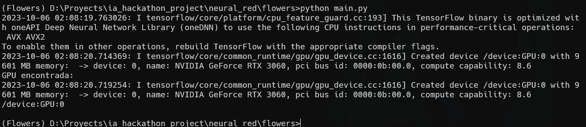
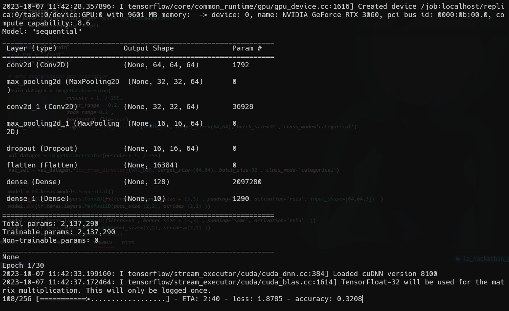
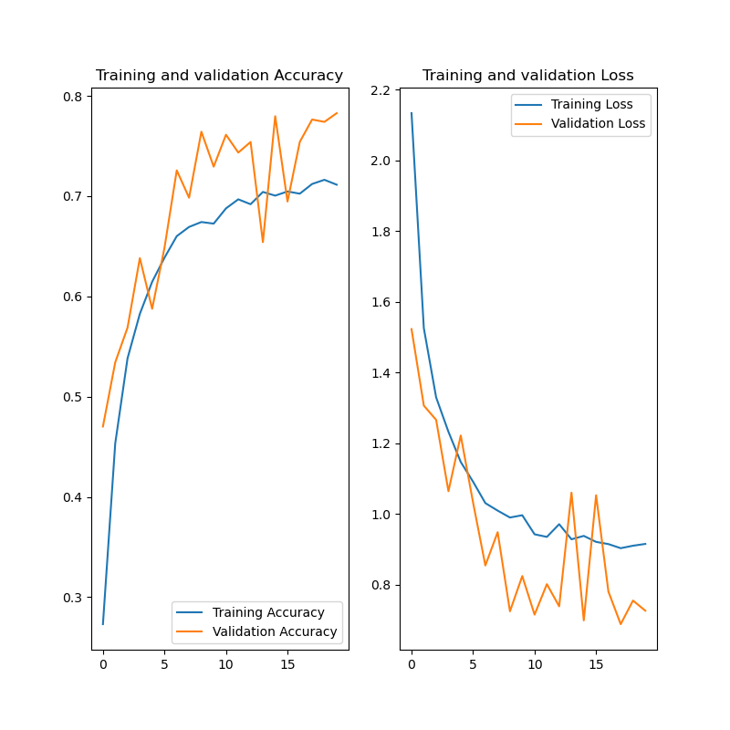

## Instalación del Entorno Conda "Flowers"

1. Descarga e instala Anaconda desde [el sitio web oficial](https://www.anaconda.com/download).

2. Abre "Anaconda Prompt" desde tu sistema operativo.

3. Ubícate en tu carpeta de trabajo deseada. Por ejemplo, si tu carpeta de trabajo está en `D:/Work`, utiliza el siguiente comando:

   ```shell
   cd D:/Work
    ```

1. Crea un nuevo entorno conda llamado "Flowers" con Python 3.10 utilizando el siguiente comando:
   ```shell
    conda create -n Flowers python=3.10
   ```
2. Activa el entorno conda "Flowers" con el siguiente comando:
   ```shell
    conda activate Flowers
   ```
   Para desactivar el entorno conda "Flowers" cuando se deje de usar es el siguiente comando:
   ```shell
    conda deactivate
   ```
3. Instala las bibliotecas necesarias para TensorFlow y GPU con los siguientes comandos:
   ```shell
    conda install -c conda-forge cudatoolkit=11.2 cudnn=8.1.0
   ```
4. Instala TensorFlow versión <2.11 y otras bibliotecas esenciales con estos comandos:
   ```shell
    python -m pip install "tensorflow<2.11"
    conda install matplotlib opencv scikit-learn pandas
    pip install imutils
   ```


### Verificación de la Instalación de TensorFlow
Para verificar si TensorFlow se ha instalado correctamente, puedes copiar y pegar el siguiente código en un archivo llamado main.py:
```python
    import tensorflow as tf

    # Verifica si TensorFlow detecta alguna GPU
    if tf.test.gpu_device_name():
        print("GPU encontrada:")
        print(tf.test.gpu_device_name())
    else:
        print("No se encontró una GPU. TensorFlow está utilizando la CPU.")
```
Luego, ejecuta el siguiente comando en tu entorno conda "Flowers":
```shell
    python main.py
```
Si la instalación se realizó con éxito, deberías ver una salida que indica si se ha encontrado una GPU o si TensorFlow está utilizando la CPU. Como esta salida:



## Creación de Modelo de Convolución para Clasificar Flores con Deep Learning

En este proyecto, hemos creado un modelo de aprendizaje profundo utilizando redes neuronales convolucionales (CNN) para clasificar flores. Aquí te guiaré a través de los pasos principales del proceso.

### Descarga y Organización de la Base de Datos

1. Descargamos la base de datos de flores desde el siguiente enlace: [Base de Datos de Flores](https://www.kaggle.com/datasets/jonathanflorez/extended-flowers-recognition/).

2. Luego, organizamos los datos en cuatro carpetas: Original, Test, Train y Validate. Esto se hace para dividir el conjunto de datos en entrenamiento, prueba y validación.

### Entrenamiento del Modelo

Ejecutamos el código del archivo `model.py` en nuestro entorno virtual de Anaconda utilizando el siguiente comando:

```bash
python model.py
```

También ejecutamos el archivo `model2.py` de la misma manera:

```bash
python model2.py
```


### Comparación de Modelos

Después de ejecutar los modelos, generamos dos gráficos utilizando la biblioteca Matplotlib para comparar su rendimiento.

Modelo 1: Gráfico del Modelo 1


Modelo 2: Gráfico del Modelo 2
.png)
Basándonos en la comparación de estos gráficos, decidimos que el modelo 1 es el más adecuado para nuestra tarea de clasificación de flores.

### Exportación del Modelo a Formato JSON
Para usar el modelo en el backend de nuestra aplicación, lo exportamos a formato JSON. Creamos una carpeta llamada "Output" y utilizamos el siguiente comando en nuestro entorno virtual anaconda:

```bash
tensorflowjs_converter --input_format keras flowers.h5 Output
```
Esto nos proporciona los archivos necesarios para utilizar el modelo en nuestra aplicación.

Con esto, hemos completado con éxito la creación y evaluación de nuestro modelo de convolución para clasificar flores.
